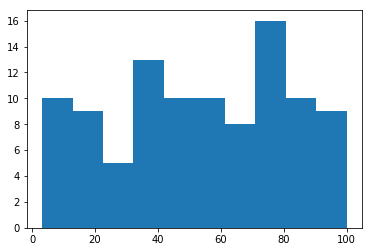
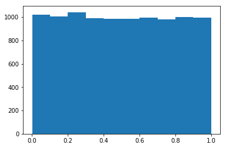
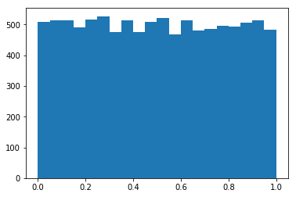
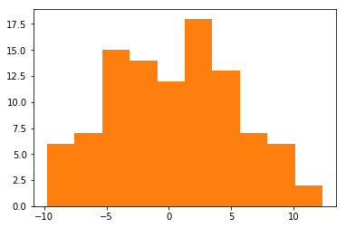

# Histogram


```python
import pandas as pd
import numpy as np
import matplotlib.pyplot as plt

A = pd.read_csv('C:/Users/dubek/Downloads/New folder/data_1d.csv', header=None).as_matrix()
x = A[:,0]
y = A[:,1]
```


```python
plt.hist(x)
```


    (array([ 10.,   9.,   5.,  13.,  10.,  10.,   8.,  16.,  10.,   9.]),
     array([  3.21124861,  12.88597188,  22.56069515,  32.23541842,
             41.91014169,  51.58486496,  61.25958823,  70.9343115 ,
             80.60903477,  90.28375804,  99.95848131]),
     <a list of 10 Patch objects>)


```python
plt.show()
```





```python
R = np.random.random(10000)
plt.hist(R)
plt.show()
```





```python
plt.hist(R, bins=20)
plt.show()
```





```python
y_actual = 2*x +1
res = y-y_actual

plt.hist(res)
plt.show()
```




