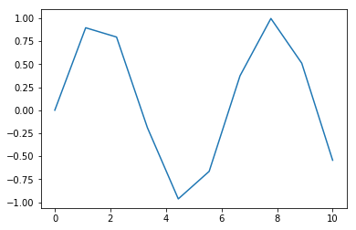
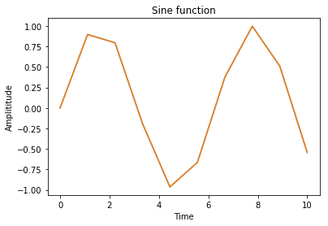
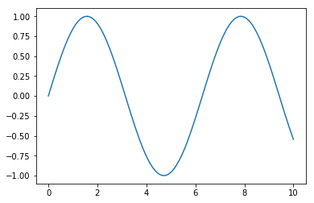

# Line Charts

We'll first import Matplotlib


```python
import matplotlib.pyplot as plt
import numpy as np
```

Creating a Linespace


```python
x = np.linspace(0,10,10)


```

Plotting sine wave


```python
y = np.sin(x)

plt.plot(x,y)

plt.show()
```





We can add other inputs before the graph is actually shown.


```python
plt.plot(x,y)

plt.xlabel("Time")
plt.ylabel("Amplititude")
plt.title("Sine function")

plt.show()
```





```python
x = np.linspace(0,10,100)

y =  np.sin(x)

plt.plot(x,y)

plt.show()
```




