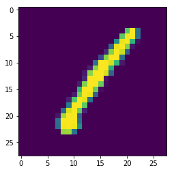
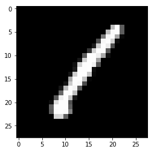

# Plotting Images


```python
import pandas as pd
import numpy as np
import matplotlib.pyplot as plt

df = pd.read_csv('Datasets/train.csv')

```


```python
df.shape
```


Output:

(42000, 785)


```python
M = df.as_matrix()
```


```python
im = M[0,1:]

```


```python
im.shape
```


Output:

(784,)


```python
im = im.reshape(28,28)
```


```python
im.shape
```


Ouput:

(28, 28)


```python
plt.imshow(im)
```


Ouutput:

<matplotlib.image.AxesImage at 0x279019ba7b8>


```python
plt.show()
```





```python
M[0,0]
```


Output:

1


```python
plt.imshow(im, cmap='gray')
```


Output:

<matplotlib.image.AxesImage at 0x27900cb2b00>


```python
plt.show()
```




