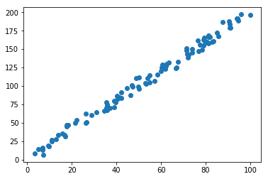
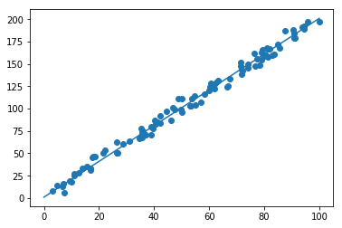

# Scatterplot


```python
import pandas as pd
import numpy as np
import matplotlib.pyplot as plt
```


```python
A = pd.read_csv('Datasets/data_1d.csv', header=None).as_matrix()
```

x-axis is the first column and y-axis is the second column.


```python
x = A[:,0]
y = A[:,1]
```


```python
plt.scatter(x,y)
plt.show()
```





```python
x_line = np.linspace(0,100,100)
y_line = 2*x_line +1
```


```python
plt.scatter(x,y)
```


    <matplotlib.collections.PathCollection at 0x2042db962b0>


```python
plt.plot(x_line,y_line)
```


    [<matplotlib.lines.Line2D at 0x2042db96588>]


```python
plt.show()
```




