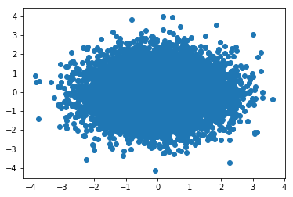
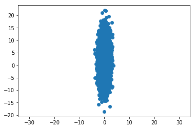

# Sampling for 2D Gaussian

So suppose we want to sample from a 2D Gazi and with means zero and variance one.

This is called a spherical Gaussian because each dimension is uncorrelated and independent of the other.


```python
from scipy.stats import norm
import numpy as np
import matplotlib.pyplot as plt

r = np.random.randn(10000,2)
```


```python
plt.scatter(r[:,0],r[:,1])
```


Output:

<matplotlib.collections.PathCollection at 0x1af551664e0>


```python
plt.show()
```





Now We want an elliptical Ghaussian. This is where the variance is different for each dimension. So let's suppose I want the standard deviation of the second dimension to be five and mean to be 2.


```python
r[:,1] = 5*r[:,1] + 2
```


```python
plt.scatter(r[:,0],r[:,1])
```


Output:

<matplotlib.collections.PathCollection at 0x1af55625208>


```python
plt.show()
```


Since we cannot see the ellipital shape because of the scaling of the axis, we'll make the axis equal.


```python
plt.scatter(r[:,0],r[:,1])
plt.axis('equal')
```


Output:

(-4.2524555371347237,
     4.0171504344257114,
     -20.676614192694778,
     24.030744770021489)


```python
plt.show()
```




