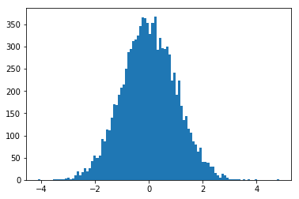
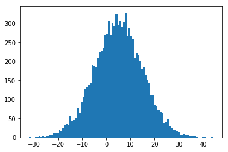

# Sampling for Gaussian


```python
from scipy.stats import norm
import numpy as np
import matplotlib.pyplot as plt

r = np.random.randn(10000)
```


```python
plt.hist(r, bins=100)
```


    (array([   1.,    0.,    0.,    0.,    0.,    0.,    1.,    1.,    1.,
               1.,    1.,    4.,    5.,    2.,    4.,   11.,   20.,   10.,
              17.,   26.,   20.,   26.,   42.,   55.,   50.,   55.,   92.,
              86.,  114.,  111.,  140.,  171.,  168.,  192.,  207.,  215.,
             250.,  288.,  295.,  312.,  316.,  324.,  346.,  365.,  364.,
             354.,  328.,  353.,  368.,  292.,  319.,  296.,  294.,  300.,
             282.,  224.,  241.,  191.,  224.,  166.,  135.,  144.,  116.,
             107.,   87.,   79.,   64.,   73.,   41.,   40.,   39.,   29.,
              30.,   16.,   11.,    5.,   14.,   10.,    5.,    2.,    2.,
               2.,    1.,    2.,    0.,    2.,    0.,    1.,    0.,    0.,
               1.,    0.,    0.,    0.,    0.,    0.,    0.,    0.,    0.,    1.]),
     array([-4.10652061, -4.01713461, -3.92774861, -3.8383626 , -3.7489766 ,
            -3.6595906 , -3.5702046 , -3.48081859, -3.39143259, -3.30204659,
            -3.21266059, -3.12327458, -3.03388858, -2.94450258, -2.85511658,
            -2.76573057, -2.67634457, -2.58695857, -2.49757257, -2.40818656,
            -2.31880056, -2.22941456, -2.14002856, -2.05064255, -1.96125655,
            -1.87187055, -1.78248455, -1.69309854, -1.60371254, -1.51432654,
            -1.42494053, -1.33555453, -1.24616853, -1.15678253, -1.06739652,
            -0.97801052, -0.88862452, -0.79923852, -0.70985251, -0.62046651,
            -0.53108051, -0.44169451, -0.3523085 , -0.2629225 , -0.1735365 ,
            -0.0841505 ,  0.00523551,  0.09462151,  0.18400751,  0.27339351,
             0.36277952,  0.45216552,  0.54155152,  0.63093752,  0.72032353,
             0.80970953,  0.89909553,  0.98848153,  1.07786754,  1.16725354,
             1.25663954,  1.34602555,  1.43541155,  1.52479755,  1.61418355,
             1.70356956,  1.79295556,  1.88234156,  1.97172756,  2.06111357,
             2.15049957,  2.23988557,  2.32927157,  2.41865758,  2.50804358,
             2.59742958,  2.68681558,  2.77620159,  2.86558759,  2.95497359,
             3.04435959,  3.1337456 ,  3.2231316 ,  3.3125176 ,  3.4019036 ,
             3.49128961,  3.58067561,  3.67006161,  3.75944761,  3.84883362,
             3.93821962,  4.02760562,  4.11699162,  4.20637763,  4.29576363,
             4.38514963,  4.47453564,  4.56392164,  4.65330764,  4.74269364,
             4.83207965]),
     <a list of 100 Patch objects>)


```python
plt.show()
```





So if we want to sample from Gausi and distribution that has an arbitrary mean and standard deviation. We can in fact use the same function. We just need to scale it and add the mean.


```python
r = 10*np.random.randn(10000) + 5
plt.hist(r, bins=100)
plt.show()
```




