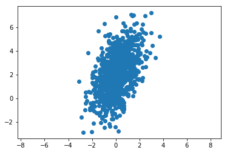
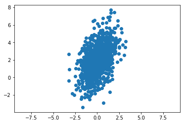

# Sampling for General Multivariate Normal

We will see a sample from a general multivariate normal distribution where the dimensions are not necessarily independent from one another.

This means we have a full covariance matrix.


```python
from scipy.stats import norm
import numpy as np
import matplotlib.pyplot as plt
from scipy.stats import multivariate_normal as mvn

cov = np.array([[1,0.8],[0.8,3]])
mu = np.array([0,2])
```


```python
r = mvn.rvs(mean=mu, cov=cov, size=1000 )
```


```python
plt.scatter(r[:,0],r[:,1])
```


Output:

<matplotlib.collections.PathCollection at 0x27eb7bf5a90>


```python
plt.axis('equal')
plt.show()
```





There is a way to draw the samples using numpy as well.


```python
r = np.random.multivariate_normal(mean=mu, cov=cov, size=1000 )
```


```python
plt.scatter(r[:,0],r[:,1])
plt.axis('equal')
plt.show()
```




